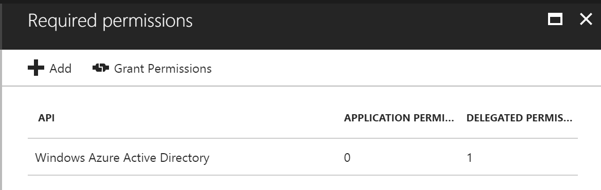

# Basic SSO - PHP version

In this sample we show you how to integrate Azure Active Directory(Azure AD) to provide secure sign in and authorization. 

The code in the following sections is part of the full featured PHP app and presented as a new project for clarity and separation of functionality.

**Table of contents**
* [Register the application in Azure Active Directory](#register-the-application-in-azure-active-directory)
* [Build and debug locally](#build-and-debug-locally)


# Build and deploy the Starter Project

Make sure that Laravel 5.4 can run on local machine. Otherwise following [this article](https://laravel.com/docs/5.4/installation) to create a dev environment. 

 PHPStorm is used as editor.

The starter project is a simple application with only SQL authentication configured.  By updating this project, you can see how to integrate O365 Single Sign On to an application with existing authentication.

1. Open PHPStorm as administrator, open the project under **Starter Project** folder. The starter project you can register a new user, login and then display a basic page with login user info.

2. Open **Terminal** command window, type **Composer Update** and then press Enter.

   

3. Make sure there's a file named .env on root folder of the project. If there's no such file, download it from [Laravel GitHub](https://github.com/laravel/laravel/blob/master/.env.example) and then rename it to .env. Run **php artisan key:generate** on **Terminal**. 

4. Run the application locally.

5. Click the Register link to register as a user.

   

6. Complete the form to add a user.

   

7. Once registered, you should see a blank page.


## Register the application in Azure Active Directory

1. Sign in to the Azure portal: [https://portal.azure.com/](https://portal.azure.com/).

2. Choose your Azure AD tenant by selecting your account in the top right corner of the page.

3. Click **Azure Active Directory** -> **App registrations** -> **+Add**.

   

4. Input a **Name**, and select **Web app / API** as **Application Type**.

   Input **Sign-on URL**: https://localhost:44377/

   

   Click **Create**.

   Notice: Sign-on URL should match your local dev environment URL.

5. Once completed, the app will show in the list.

   

6. Click it to view its details. 

   

7. Click **All settings**, if the setting window did not show.

     

     Copy aside **Application ID**, then Click **Save**.

     Click **Reply URLs**, add the following URL into it.

     [https://localhost:44377/](https://localhost:44377/)

   * Click **Required permissions**. Add the following permissions:

     | API                            | Application Permissions | Delegated Permissions         |
     | ------------------------------ | ----------------------- | ----------------------------- |
     | Windows Azure Active Directory |                         | Sign in and read user profile |

     

   * Click **Keys**, then add a new key

     

     Click **Save**, then copy aside the **VALUE** of the key. 

   Close the Settings window.


## Add Single Sign On


1. Open the Starter Project in PHPStorm, if it isn't already open.  

2. Open .env file on project root.  Add two new keys **CLIENT_ID** and **CLIENT_SECRET**. These keys will be used to identity in your apps with Windows Azure Active Directory.

   

   ​	**CLIENT_ID**: use the Client Id of the app registration you created earlier.

   ​	**CLIENT_SECRET**: use the Key value of the app registration you created earlier.

3. Edit **resources\views\auth\login.blade.php**. Find the last **div** with class **col-md-5** and paste the following inside it.

   ```html
               <h4 class="margin-btm-20">Use your school account</h4>
               <div id="socialLoginList">
                   <p>
                      <a href="{{url('/o365login ')}}"  >
                       <button type="button" class="btn btn-default btn-ms-login" id="OpenIdConnect" name="provider" value="OpenIdConnect" title="Log in using your Microsoft Work or school account"></button>
                      </a>
                   </p>
               </div>
   ```

   

   This will add an O365 login button to login page.

   To see how this file works in the Demo app, refer to the file located [here](../resources/views/auth/login.blade.php) in the Demo app.

4. Edit routes\web.php. On the bottom of the file paste the following 

   ```php
   Route::group(['middleware' => ['web']], function () {
       Route::get('/oauth.php', 'O365AuthController@oauth');
       Route::get('/o365login', 'O365AuthController@o365Login');
   });
   ```

   This will add two routes for O365 login and handle login result from O365. **O365AuthController** will be added in next step.

   To see how this file works in the Demo app, refer to the file located [here](../routes/web.php) in the Demo app.

5. Add a new file named **O365AuthController.php** inside **app\Http\Controllers** folder, remove all generated code and paste the following.  

   ```php
   <?php

   namespace App\Http\Controllers;
   use App\Http\Middleware\SocializeAuthMiddleware;
   use Laravel\Socialite\Facades\Socialite;
   use Socialize;

   class O365AuthController extends Controller
   {

       public function __construct()
       {

       }
       /**
        * Redirect the user to the OAuth Provider.
        */
       public function o365Login()
       {
           return Socialize::with('O365')->redirect();
       }

       /**
        * Handle provider callback.
        */
       public function oauth()
       {
           $user = Socialite::driver('O365')->user();
           SocializeAuthMiddleware::setSocializeSessions($user, '', '');
           return redirect("/schools");
       }

   }
   ```

   This controller is used for O365 user login redirect and handle login result after callback.

   To see how this file works in the Demo app, refer to the file located [here](../app/Http/Controllers/O365AuthController.php) in the Demo app.

6. Add a new file named **graph.php** inside **/config** folder, remove all generated code and paste the following.  

   ```php
   <?php
   namespace Microsoft\Graph\Connect;

   class Constants
   {

       const CLIENT_ID               = 'CLIENT_ID';
       const CLIENT_SECRET           = 'CLIENT_SECRET';
       const SOURCECODERESPOSITORYURL= 'SOURCECODERESPOSITORYURL';

       const AUTHORITY_URL        = 'https://login.microsoftonline.com/common';
       const AUTHORIZE_ENDPOINT   = '/oauth2/authorize';
       const TOKEN_ENDPOINT       = '/oauth2/token';
       const MSGraph          = 'https://graph.microsoft.com';
       const AADGraph         = 'https://graph.windows.net';
       const MSGraph_VERSION  ='beta';

       const O365GroupConversationsUrlFormat = "https://outlook.office.com/owa/?path=/group/%s/mail&exsvurl=1&ispopout=0";

   }
   ```

   This is a file that defines constant parameters that will be used for O365 authentication.

   To see how this file works in the Demo app, refer to the file located [here](../config/graph.php) in the Demo app.

7. Add a new file named **SocializeAuthMiddleware.php** inside **app\Http\Middleware** folder, remove all generated code and paste the following.  

   ```php
   <?php

   namespace App\Http\Middleware;

   use App\Config\SiteConstants;
   use App\Config\UserType;
   use Closure;
   use Illuminate\Support\Facades\Auth;
   use App\User;

   class SocializeAuthMiddleware
   {
       public function handle($request, Closure $next)
       {
           if (!Auth::user()) {
               if (isset($_SESSION[SiteConstants::SocializeUser])) {
                   $userInfo = $_SESSION[SiteConstants::SocializeUser];
                   $jsonUser = json_decode(json_encode($userInfo['user']));
                   $user = new User();
                   $user->userType = UserType::O365;
                   $user->firstName =$jsonUser->user->givenName;
                   $user->lastName = $jsonUser->user->surname;
                   $user->o365UserId = $jsonUser->id;
                   $user->o365Email = $jsonUser->email;
                   $user->OrganizationId = $userInfo['organizationId'];
                   $user->tenantId = $userInfo['tenantId'];
                   Auth::login($user);
               }
           }
           return $next($request);
       }

       public static function removeSocializeSessions()
       {
           $_SESSION[SiteConstants::SocializeUser]=null;
       }

       public static function setSocializeSessions($user,$orgId,$tenantId)
       {
           $arrData = array(
               'user'=>$user,
               'organizationId'=>$orgId,
               'tenantId' =>$tenantId
           );
           $_SESSION[SiteConstants::SocializeUser] = $arrData;
       }
   }

   ```

   This class integrate O365 user with PHP authentication framework. The current O365 user could be got through Auth:user().

   To see how this file works in the Demo app, refer to the file located [here](../app/Http/Middleware/SocializeAuthMiddleware.php) in the Demo app.

8. Edit **app\Http\Kernel.php**. Update **$middleware** array and replace with the following.  

   ```
       protected $middleware = [
           \Illuminate\Foundation\Http\Middleware\CheckForMaintenanceMode::class,
           \Illuminate\Foundation\Http\Middleware\ValidatePostSize::class,
           \App\Http\Middleware\TrimStrings::class,
           \Illuminate\Foundation\Http\Middleware\ConvertEmptyStringsToNull::class,
           \App\Http\Middleware\SocializeAuthMiddleware::class,
       ];
   ```

   This adds **\App\Http\Middleware\SocializeAuthMiddleware::class** to the middleware. 

   To see how this file works in the Demo app, refer to the file located [here](../app/Http/Kernel.php) in the Demo app.

9. Add a new file named **O365Provider.php** inside **app\Providers** folder, remove all generated code and paste the following.  

   ```php
   <?php

   namespace App\Providers;
   ```


   use App\Config\SiteConstants;


   class O365Provider extends \SocialiteProviders\Azure\Provider
   {

       protected $version = '1.6';

       /**
        * Overwrite the base method to enable login_hint.
        * {@inheritdoc}
        * If there's cookie for email, add a login_hint on O365 login url.
        */
       protected function getAuthUrl($state)
       {
           $url = parent::getAuthUrl($state);
           //login_hint
           $mail = '';
           $showPrompt = isset($_SESSION[SiteConstants::ShowLoginPrompt])?$_SESSION[SiteConstants::ShowLoginPrompt]:false;
    
           if (!$showPrompt) {
               if($mail)
                   $url = $this->AddNewParameter($url,'login_hint',$mail);
           }else{
               $url = $this->AddNewParameter($url,'prompt','login');
           }
           return $url;
       }
    
       private function AddNewParameter($url,$parameter,$value)
       {
           if (strpos($url, '?') > 0) {
               return $url . '&' . $parameter .'=' . $value;
           } else {
              return $url = $url . '?' . $parameter .'=' . $value;
           }
       }

   }

   ```

   This class overwrite the base method to enable login_hint when login on O365.  

   To see how this file works in the Demo app, refer to the file located [here](../app/Providers/O365Provider.php) in the Demo app.

10. Add a new file named **O365ExtendSocialite.php** inside **app\Providers** folder, remove all generated code and paste the following.  

   ```php
   <?php

   namespace App\Providers;

   use SocialiteProviders\Manager\SocialiteWasCalled;

   class O365ExtendSocialite
   {

       public function handle(SocialiteWasCalled $socialiteWasCalled)
       {
           $socialiteWasCalled->extendSocialite(
               'O365', __NAMESPACE__.'\O365Provider'
           );
       }
   }

   ```

   This class executes the O365 provider.

   To see how this file works in the Demo app, refer to the file located [here](../app/Providers/O365ExtendSocialite.php) in the Demo app.

11. Edit **config\services.php**, remove all code and paste the following. 

    ```php
    <?php

    use Microsoft\Graph\Connect\Constants;

    return [
        'mailgun' => [
            'domain' => env('MAILGUN_DOMAIN'),
            'secret' => env('MAILGUN_SECRET'),
        ],

        'ses' => [
            'key' => env('SES_KEY'),
            'secret' => env('SES_SECRET'),
            'region' => 'us-east-1',
        ],

        'sparkpost' => [
            'secret' => env('SPARKPOST_SECRET'),
        ],

        'stripe' => [
            'model' => App\User::class,
            'key' => env('STRIPE_KEY'),
            'secret' => env('STRIPE_SECRET'),
        ],
        'O365' => [
            'client_id' => env(Constants::CLIENT_ID),
            'client_secret' => env(Constants::CLIENT_SECRET),
            'redirect' => 'http'.(empty($_SERVER['HTTPS'])?'':'s').'://'.$_SERVER['HTTP_HOST'].'/oauth.php',
        ],
    ];

    ```

     Register a new service named **O365**. This service will be used on O365 login controller.

    To see how this file works in the Demo app, refer to the file located [here](../config/services.php) in the Demo app.

12. Run the project locally. Click the **Sign in with Office 365** button and then login to O365.

    

13. After login with O365 user it will redirect to a basic page.

    


Copyright (c) 2017 Microsoft. All rights reserved.