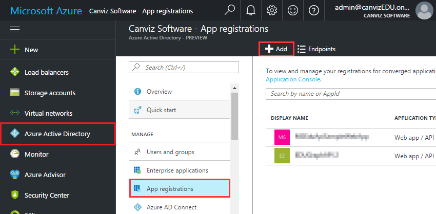
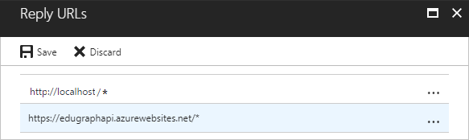
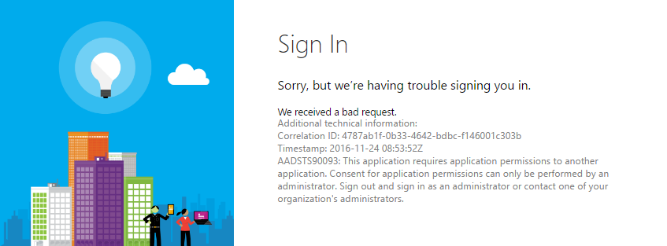
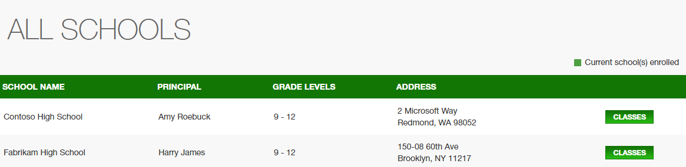

# EDUGraphAPI - Office 365 Education Code Sample

In this sample, we show you how to integrate with school roles/roster data as well as O365 services available via the Graph API. 

School data is kept in sync in O365 Education tenants by [Microsoft School Data Sync](http://sds.microsoft.com).  

**Table of contents**

- [Sample Goals](#sample-goals)
- [Prerequisites](#prerequisites)
- [Register the application in Azure Active Directory](#register-the-application-in-azure-active-directory)
- [Run the sample locally](#run-the-sample-locally)
- [Deploy the sample to Azure](#deploy-the-sample-to-azure)
- [Understand the code](#understand-the-code)
- [Questions and comments](#questions-and-comments)
- [Contributing](#contributing)

## Sample Goals

The sample demonstrates:

- Calling Graph APIs, including:

  - [Microsoft Azure Active Directory Graph API](https://www.nuget.org/packages/Microsoft.Azure.ActiveDirectory.GraphClient/)
  - [Microsoft Graph API](https://www.nuget.org/packages/Microsoft.Graph/)

- Linking locally-managed user accounts and Office 365 (Azure Active Directory) user accounts. 

  After linking accounts, users can use either local or Office 365 accounts to log into the sample website and use it.

- Getting schools, sections, teachers, and students from Office 365 Education:

  - [Office 365 Schools REST API reference](https://msdn.microsoft.com/office/office365/api/school-rest-operations)
  - A [Differential Query](https://msdn.microsoft.com/en-us/library/azure/ad/graph/howto/azure-ad-graph-api-differential-query) is used to sync data that is cached in a local database by the SyncData Web Job.

The sample is implemented with the PHP language and the [Laravel](https://laravel.com/) framework.

> [Laravel](https://laravel.com/) is a PHP web application framework with expressive, elegant syntax.  It attempts to take the pain out of development by easing common tasks used in the majority of web projects.
>
> Laravel is accessible, yet powerful, providing tools needed for large, robust applications. A superb combination of simplicity, elegance, and innovation give you tools you need to build any application with which you are tasked.

## Prerequisites

### **Deploying and running this sample requires**:

- An Azure subscription with permissions to register a new application, and deploy the web app.

- An O365 Education tenant with Microsoft School Data Sync enabled

  - One of the following browsers: Edge, Internet Explorer 9, Safari 5.0.6, Firefox 5, Chrome 13, or a later version of one of these browsers.

  Additionally: Developing/running this sample locally requires the following:  

  - [PHP 7.0](http://php.net/downloads.php)
  - [Composer](https://getcomposer.org/download/)
  - [Git](https://git-scm.com/download/win)
  - Familiarity with PHP and [Laravel](https://laravel.com/).

## **Generate a self-signed certificate**

A self-signed certificate is required by the SyncData WebJob. For preview, you may skip the steps below and use the default certificate we provided:

- Certificate file: `/App_Data/jobs/triggered/SyncData/app_only_cert.pfx`
- Password: `J48W23RQeZv85vj`
- Key credential: `/App_Data/jobs/triggered/SyncData/key_credential.txt`

For production, you should use your certificate:

**Generate certificate with PowerShell**

This file will be used in web job.

Run PowerShell **as administrator**, then execute the commands below:

```powershell
$cert = New-SelfSignedCertificate -Type Custom -KeyExportPolicy Exportable -KeySpec Signature -Subject "CN=Edu App-only Cert" -NotAfter (Get-Date).AddYears(20) -CertStoreLocation "cert:\CurrentUser\My" -KeyLength 2048
```

> Note: please keep the PowerShell window open until you finish the steps below.

**Get keyCredential**

Execute the commands below to get keyCredential:

> Note: Feel free to change the file path at the end of the command.

```powershell
$keyCredential = @{}
$keyCredential.customKeyIdentifier = [System.Convert]::ToBase64String($cert.GetCertHash())
$keyCredential.keyId = [System.Guid]::NewGuid().ToString()
$keyCredential.type = "AsymmetricX509Cert"
$keyCredential.usage = "Verify"
$keyCredential.value = [System.Convert]::ToBase64String($cert.GetRawCertData())
$keyCredential | ConvertTo-Json > c:\keyCredential.txt
```

The keyCredential is in the generated file, and will be used to create App Registrations in AAD.


### Export the Certificate and Convert to Base64 String

You will be prompted to input a password to protect the certificate. Please copy aside the password. It will be used as the value of the **Certificate Pfx Password** parameter of the ARM Template

The base64 string of the certificate is in the generated text file, and will be used as the value of the **Certificate Pfx Base64** parameter of the ARM Template.


Execute the commands below to export the certificate.

```
$password = Read-Host -Prompt "Enter password" -AsSecureString
Export-PfxCertificate -Cert $cert -Password $password -FilePath c:\app_only_cert.pfx
```


## Register the application in Azure Active Directory

1. Sign into the new Azure portal: [https://portal.azure.com/](https://portal.azure.com/).

2. Choose your Azure AD tenant by selecting your account in the top right corner of the page:

   

3. Click **Azure Active Directory** -> **App registrations** -> **+Add**.

   

4. Input a **Name**, and select **Web app / API** as **Application Type**.

   Input **Sign-on URL**: http://localhost. 

   

   Click **Create**.

5. Once completed, the app will show in the list.

   

6. Click it to view its details. 

   

7. Click **All settings**, if the setting window did not show.

   - Click **Properties**, then set **Multi-tenanted** to **Yes**.

     

     Copy aside **Application ID**, then Click **Save**.

   - Click **Required permissions**. Add the following permissions:

     | API                            | Application Permissions       | Delegated Permissions                                        |
     | ------------------------------ | ----------------------------- | ------------------------------------------------------------ |
     | Microsoft Graph                | Read all users' full profiles<br>Read the organization's roster | Read directory data<br>Access directory as the signed in user<br>Sign users in<br> Have full access to all files user can access<br> Have full access to user files<br> Read and write users' class assignments and their grades<br>Read users' view of the roster <br>Read all groups |
     | Windows Azure Active Directory |                               | Sign in and read user profile<br>Read and write directory data |

     

     

     

   - Click **Keys**, then add a new key:

     

     Click **Save**, then copy aside the **VALUE** of the key. 

8. Click **Manifest**.

     

     

     Copy the keyCredential (all the text) from `key_credential.txt` file.

     Insert the keyCredential into the square brackets of the **keyCredentials** node.

     

     Click **Save**.

     > Note: this step configures the certification used by a Web Job. Check **Application Authentication Flow** section for more details.

   Close the Settings window.

## Run the sample locally

Follow the steps below to run this sample on a windows server:

1. Download [XAMPP](https://www.apachefriends.org/download.html) and install it to a local folder, for example **c:\xmapp**. Notice: the minimal PHP version is 7.0. Add **C:\xampp\php** to environment variables.

2. Download and install [Composer](https://getcomposer.org/).

3. Download the source code from Github and extra to a local folder like **C:\O365-EDU-PHP-Samples**.

4. Open command window on the folder **C:\O365-EDU-PHP-Samples** and run **composer update**.

   

5. Create the .env file in the local folder and configure the values:

   

   - **APP_KEY:** use "php artisan key:generate" command to generate a new key.
   - **CLIENT_ID**: use the Client Id of the app registration you created earlier.
   - **CLIENT_SECRET**: use the Key value of the app registration you created earlier.
   - **SOURCECODEREPOSITORYRL**: use the URL of this repository.

6. Edit **httpd-vhosts.conf** under **C:\xampp\apache\conf\extra**. Add below content in green square and make the path in read square match to the path in step 3.

   

7. Restart xmapp server and visit http://localhost. 


## Deploy the sample to Azure

**GitHub Authorization**

1. Generate Token

   - Open https://github.com/settings/tokens in your web browser.
   - Sign into your GitHub account where you forked this repository.
   - Click **Generate New Token**
   - Enter a value in the **Token description** text box
   - Select the followings (your selections should match the screenshot below):
     - repo (all) -> repo:status, repo_deployment, public_repo
     - admin:repo_hook -> read:repo_hook

   

   - Click **Generate token**
   - Copy the token

2. Add the GitHub Token to Azure in the Azure Resource Explorer

   - Open https://resources.azure.com/providers/Microsoft.Web/sourcecontrols/GitHub in your web browser.
   - Log in with your Azure account.
   - Selected the correct Azure subscription.
   - Select **Read/Write** mode.
   - Click **Edit**.
   - Paste the token into the **token parameter**.

   

   - Click **PUT**

**Deploy the Azure Components from GitHub**

1. Check to ensure that the build can run in local environment.

2. Fork this repository to your GitHub account.

3. Click the Deploy to Azure Button:

   [](https://portal.azure.com/#create/Microsoft.Template/uri/https%3A%2F%2Fraw.githubusercontent.com%2FOfficeDev%2FO365-EDU-PHP-Samples%2Fmaster%2Fazuredeploy.json)

4. Fill in the values in the deployment page and select the **I agree to the terms and conditions stated above** checkbox.

   

   - **Resource group**: we suggest you create a new group.

   - **Site Name**: please input a name. Like EDUGraphAPICanviz or EDUGraphAPI993.

     > Note: If the name you input is taken, you will get some validation errors:
     >
     > 
     >
     > Click it you will get more details like storage account is already in other resource group/subscription.
     >
     > In this case, please use another name.

   - **Source Code Repository URL**: replace <YOUR REPOSITORY> with the repository name of your fork.

   - **Source Code Manual Integration**: choose **false**, since you are deploying from your own fork.

   - **Client Id**: use the Client Id of the app registration you created earlier.

   - **Client Secret**: use the Key value of the app registration you created earlier.

   - Check **I agree to the terms and conditions stated above**.

5. Click **Purchase**.

**Add REPLY URL to the app registration**

1. After the deployment, open the resource group:

   

2. Click the web app.

   

   Copy the URL aside and change the schema to **https**. This is the replay URL and will be used in next step.

3. Navigate to the app registration in the new Azure portal, then open the setting windows.

   Add the reply URL:

   

   > Note: to debug the sample locally, make sure that http://localhost is in the reply URLs.

4. Click **SAVE**.

## Understand the code

### Introduction

**Solution Component Diagram**


**Authentication Mechanisms**

We utilized the built-in [authentication](https://laravel.com/docs/5.4/authentication) of the Laravel framework to enable user login.

- **Local users authentication**: implemented by the default Eloquent authentication driver. The `App\User` [Eloquent model](https://laravel.com/docs/5.4/eloquent) is included to access users stored in the database.

- **O365 users authentication**: implemented by [Laravel Socialite](https://github.com/laravel/socialite) and `App\Providers\O365Provider` which is based on the [Microsoft Azure](http://socialiteproviders.github.io/providers/microsoft-azure/) service provider.

  > [Laravel Socialite](https://github.com/laravel/socialite) provides an expressive, fluent interface to OAuth authentication with Facebook, Twitter, Google, LinkedIn, GitHub and Bitbucket. It handles almost all of the boilerplate social authentication code you are dreading writing.
  >
  > Adapters for other platforms like [Microsoft Azure](http://socialiteproviders.github.io/providers/microsoft-azure/) are listed at the community driven [Socialite Providers](https://socialiteproviders.github.io/) website.

[thephpleague/oauth2-client](https://github.com/thephpleague/oauth2-client) is used to handle tokens.

**Data Access**

[Eloquent](https://laravel.com/docs/5.4/eloquent) is used to access data stored in the MySQL database.

The tables used in this demo:

| Table                        | Description                              |
| ---------------------------- | ---------------------------------------- |
| Users                        | Contains the user's information: name, email, password...<br>*o365UserId* and *o365Email* are used to connect the local user with an O365 user. |
| UserRoles                    | Contains users' role. Three roles are used in this sample: admin, teacher, and student. |
| Organizations                | A row in this table represents a tenant in AAD.<br>*isAdminConsented* column records than if the tenant consented by an administrator. |
| TokenCache                   | Contains the users' access/refresh tokens. |
| ClassroomSeatingArrangements | Contains the classroom seating arrangements. |

**Controllers**

Below are the main controllers used by the sample.

| Controller         | Description                              |
| ------------------ | ---------------------------------------- |
| LoginController    | contains actions for local users to log in. |
| O365AuthController | contains actions for O365 users to log in |
| LinkController     | implements the **Local/O365 Login Authentication Flow**. Please check [Authentication Flows](https://github.com/TylerLu/EDUGraphAPI#authentication-flows) section for more details. |
| AdminController    | contains the admin actions               |
| SchoolsController  | contains actions to show schools and classes. `SchoolsService` class is mainly used by this controller. Please check [Office 365 Education API](https://github.com/TylerLu/EDUGraphAPI#office-365-education-api) section for more details. |

All the controllers are under the **app/Http/Controller** folder.

**Middlewares**

We create several middlewares for authentication and authorization.

| Middleware              | Description                              |
| ----------------------- | ---------------------------------------- |
| AdminOnlyMiddleware     | Only allows admin to access the protected routes. It is mainly used for AdminController. |
| LinkRequiredMiddleware  | Redirects unlinked users to /link. It is mainly used for the SchoolsController. |
| SocializeAuthMiddleware | Integrate O365 user with PHP authentication framework. The current O365 user could be got through ```Auth:user()```. |

All the middleware are in the **app/Http/Middleware**.

**Services**

Below are the main services used by the sample:

| Service           | Description                              |
| ----------------- | ---------------------------------------- |
| AADGraphService   | Contains methods used to access AAD Graph REST APIs. |
| MSGraphService    | Contains methods used to access MS Graph REST APIs. |
| EducationService  | Contains methods like get user information,  get schools/classes/users/assignments, get/update seating arrangements. |
| CookieService     | Contains methods that used to manage cookies. |
| TokenCacheService | Contains methods used to get and update token cache from the database. |
| UserService       | Contains methods used to manipulate users in the database. |
| AdminService      | Contains administrative methods like consent tenant, manage linked accounts. |

All the services are in the **app/Services** folder.

**Multi-tenant app**

This web application is a **multi-tenant app**. In the AAD, we enabled the option:


Users from any Azure Active Directory tenant can access this app. Some permissions used by this app require an administrator of the tenant to consent before users can use the app. Otherwise, users will see this error:



For more information, see [Build a multi-tenant SaaS web application using Azure AD & OpenID Connect](https://azure.microsoft.com/en-us/resources/samples/active-directory-dotnet-webapp-multitenant-openidconnect/).

### Office 365 Education API

The [Office 365 Education APIs](https://msdn.microsoft.com/office/office365/api/school-rest-operations) return data from any Office 365 tenant which has been synced to the cloud by Microsoft School Data Sync. The APIs provide information about schools, sections, teachers, students, and rosters. The Schools REST API provides access to school entities in Office 365 for Education tenants.

In this sample, the `App\Services\EducationService` class encapsulates the Office 365 Education API. 

**Get schools**

~~~typescript
public function getSchools()
{
 return $this->getAllPages( "education/schools", School::class);
}
~~~

~~~typescript
public function getSchool($objectId)
{
    return $this->getResponse( "education/schools/" . $objectId , School::class, null, null);
}
~~~

**Get classes**

~~~typescript
public function getSections($schoolId, $top, $skipToken)
{
    return $this->getResponse( 'education/schools/' . $schoolId . '/classes', Section::class, $top, $skipToken);

}
~~~

```typescript
public function getSectionWithMembers($objectId)
{
    return $this->getResponse( 'education/classes/' . $objectId . '?$expand=members', Section::class, null, null);
}
```
**Get assignments**

```typescript
   public function getAssignments($classId)
    {
        return $this->getAllPages( 'education/classes/' . $classId . '/assignments', Assignment::class);
    }
```
Below are some screenshots of the sample app that show the education data.




### Authentication Flows

There are 4 authentication flows in this project.

The first 2 flows (Local Login/O365 Login) enable users to login in with either a local account or an Office 365 account, then link to the other type account. This procedure is implemented in the LinkController.

**Local Login Authentication Flow**


**O365 Login Authentication Flow**


**Admin Login Authentication Flow**

This flow shows how an administrator logs into the system and performs administrative operations.

After logging into the app with an Office 365 account, the administrator will be asked to link to a local account. This step is not required and can be skipped. 

As mentioned earlier, the web app is a multi-tenant app which uses some application permissions, so tenant administrator must consent the app first.  

This flow is implemented in the AdminController. 


**Application Authentication Flow**

This flow is implemented in the SyncData WebJob.


An X509 certificate is used. For more details, please check the following links:

- [Daemon or Server Application to Web API](https://docs.microsoft.com/en-us/azure/active-directory/active-directory-authentication-scenarios#daemon-or-server-application-to-web-api)
- [Authenticating to Azure AD in daemon apps with certificates](https://azure.microsoft.com/en-us/resources/samples/active-directory-dotnet-daemon-certificate-credential/)
- [Build service and daemon apps in Office 365](https://msdn.microsoft.com/en-us/office/office365/howto/building-service-apps-in-office-365)

### Two Kinds of Graph APIs

There are two distinct Graph APIs used in this sample:

|              | [Azure AD Graph API](https://docs.microsoft.com/en-us/azure/active-directory/develop/active-directory-graph-api) | [Microsoft Graph API](https://graph.microsoft.io/) |
| ------------ | ---------------------------------------- | ---------------------------------------- |
| Description  | The Azure Active Directory Graph API provides programmatic access to Azure Active Directory through REST API endpoints. Apps can use the Azure AD Graph API to perform create, read, update, and delete (CRUD) operations on directory data and directory objects, such as users, groups, and organizational contacts | A unified API that also includes APIs from other Microsoft services like Outlook, OneDrive, OneNote, Planner, and Office Graph, all accessed through a single endpoint with a single access token. |
| Client       | Install-Package [Microsoft.Azure.ActiveDirectory.GraphClient](https://www.nuget.org/packages/Microsoft.Azure.ActiveDirectory.GraphClient/) | Install-Package [Microsoft.Graph](https://www.nuget.org/packages/Microsoft.Graph/) |
| End Point    | https://graph.windows.net                | https://graph.microsoft.com              |
| API Explorer | https://graphexplorer.cloudapp.net/      | https://graph.microsoft.io/graph-explorer |

> **IMPORTANT NOTE:** Microsoft is investing heavily in the new Microsoft Graph API, and they are not investing in the Azure AD Graph API anymore (except fixing security issues).

> Therefore, please use the new Microsoft Graph API as much as possible and minimize how much you use the Azure AD Graph API.

Below is a piece of code shows how to get "me" from the Microsoft Graph API.

```typescript
public function getMe()
{
    $json = $this->getResponse( "me", null, null, null);
    $assignedLicenses = array_map(function ($license) {
        return new Model\AssignedLicense($license);
    }, $json["assignedLicenses"]);
    ...
}
```

Note that in the AAD Application settings, permissions for each Graph API are configured separately:

 

### Differential Query

A [differential query](https://msdn.microsoft.com/en-us/Library/Azure/Ad/Graph/howto/azure-ad-graph-api-differential-query) request returns all changes made to specified entities during the time between two consecutive requests. For example, if you make a differential query request an hour after the previous differential query request, only the changes made during that hour will be returned. This functionality is especially useful when synchronizing tenant directory data with an application’s data store.

The related code is in the following folder of the project:

- **/App_Data**: contains classes that are used to demonstrate how to sync users.

In run.php, we demonstrate how to use the **DifferentialQuery** to send differential query and get differential result.

```php
$users = $msGraphHelper->queryUsers($dataSyncRecord->deltaLink,$org->tenantId,$clientId);
```

And how to update (or delete) users in local database with the delta result:

```php
    foreach ($users as $user) {
        $dbHelper->updateUser($user);
    }
```

Below is the log generated by the SyncData WebJob:

 

## Questions and comments

- If you have any trouble running this sample, please [log an issue](https://github.com/OfficeDev/O365-EDU-AspNetMVC-Samples/issues).
- Questions about GraphAPI development in general should be posted to [Stack Overflow](http://stackoverflow.com/questions/tagged/office-addins). Make sure that your questions or comments are tagged with [microsoftgraph]. 

## Contributing

We encourage you to contribute to our samples. For guidelines on how to proceed, see [our contribution guide](/CONTRIBUTING.md).

This project has adopted the [Microsoft Open Source Code of Conduct](https://opensource.microsoft.com/codeofconduct/). For more information see the [Code of Conduct FAQ](https://opensource.microsoft.com/codeofconduct/faq/) or contact [opencode@microsoft.com](mailto:opencode@microsoft.com) with any additional questions or comments.


**Copyright (c) 2017 Microsoft. All rights reserved.**
